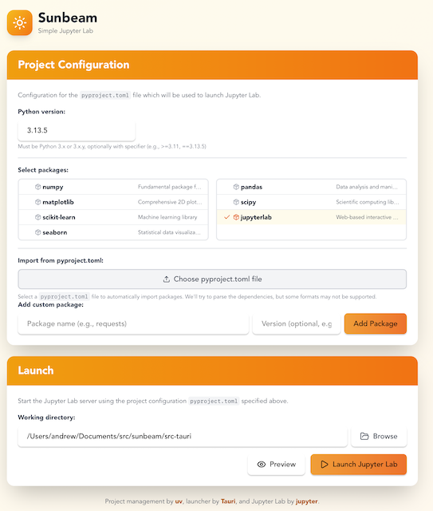
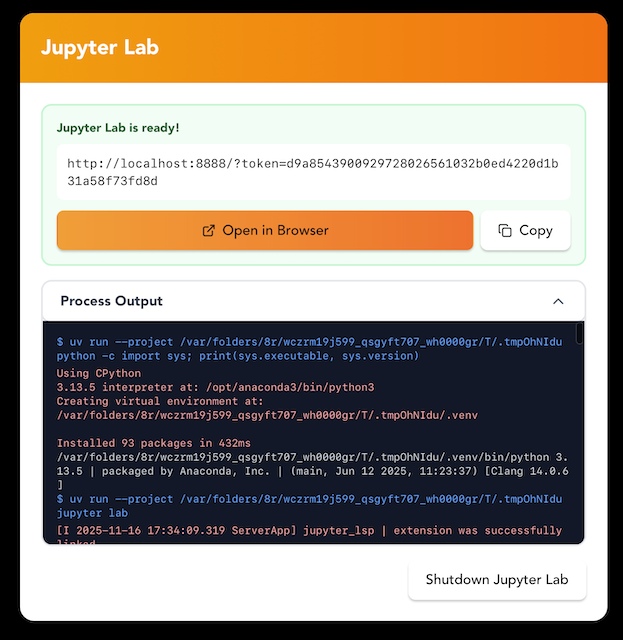
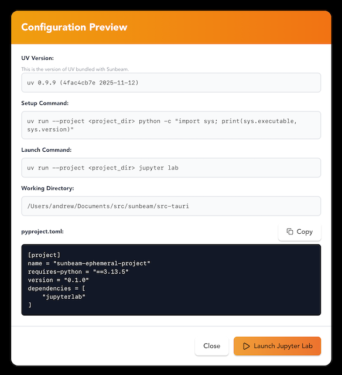

# Sunbeam - Simple Jupyter Lab

The purpose of Sunbeam is to enable non-programmers to get started with Jupyter
Lab on their own hardware. Users should not need to understand Python packages
or how to use the command line to launch Jupyter Lab with a selection of
software.

<div style="background-color: white; display: flex; align-items: center; gap: 8px; height: 3em;">
     +  = 
</div>

uv + jupyter lab = sunbeam

Sunbeam is a graphical user interface application to launch [Jupyter
Lab](https://jupyter.org) with package selection using
[uv](https://docs.astral.sh/uv/).

## Installation

Download the latest release for your platform from
https://github.com/strawlab/sunbeam/releases

### macOS: allowing an unsigned app to run

Sunbeam is not yet code-signed or notarized by Apple. Because of this, macOS
Gatekeeper places the downloaded app in "quarantine" and, when you first try to
open it, shows a warning such as *"Sunbeam" is damaged and can't be opened* or
*"Sunbeam" cannot be opened because the developer cannot be verified*. This is
expected — the app is not actually damaged; macOS simply cannot verify an
unsigned application.

To run Sunbeam, remove the quarantine flag after copying the app to your
`Applications` folder:

1. Open the downloaded `.dmg` and drag **Sunbeam** into your `Applications`
   folder.
2. Open the **Terminal** app (in `Applications/Utilities`).
3. Run the following command, entering your password if prompted:

   ```bash
   xattr -dr com.apple.quarantine /Applications/Sunbeam.app
   ```

4. You can now open Sunbeam normally from `Applications` or Launchpad.

If you copied Sunbeam somewhere other than `/Applications`, adjust the path in
the command to point at the actual location of `Sunbeam.app`.

## Screenshots

[](./docs/sunbeam-screenshot.png)
[](./docs/sunbeam-process-output.png)
[](./docs/sunbeam-config-preview.png)

## License

Copyright 2025 Andrew D. Straw

Licensed under the Apache License, Version 2.0 (the "License"); you may not use
this software except in compliance with the License. You may obtain a copy of
the License at

    http://www.apache.org/licenses/LICENSE-2.0

Unless required by applicable law or agreed to in writing, software distributed
under the License is distributed on an "AS IS" BASIS, WITHOUT WARRANTIES OR
CONDITIONS OF ANY KIND, either express or implied. See the License for the
specific language governing permissions and limitations under the License.

## Development

```bash
npm install
npm run tauri dev
```

## Icon

The sun icon comes from [lucide](https://lucide.dev).

## Update sidecar

### Build universal `uv` binary on MacOS

```bash
UV_VERSION=0.11.25
curl --remote-name --location https://github.com/astral-sh/uv/releases/download/$UV_VERSION/uv-aarch64-apple-darwin.tar.gz
curl --remote-name --location https://github.com/astral-sh/uv/releases/download/$UV_VERSION/uv-x86_64-apple-darwin.tar.gz
tar xf uv-aarch64-apple-darwin.tar.gz uv-aarch64-apple-darwin/uv
tar xf uv-x86_64-apple-darwin.tar.gz uv-x86_64-apple-darwin/uv
mkdir -p src-tauri/binaries
mv uv-aarch64-apple-darwin/uv ./src-tauri/binaries/uv-aarch64-apple-darwin
mv uv-x86_64-apple-darwin/uv ./src-tauri/binaries/uv-x86_64-apple-darwin
lipo -create ./src-tauri/binaries/uv-aarch64-apple-darwin ./src-tauri/binaries/uv-x86_64-apple-darwin -output ./src-tauri/binaries/uv-universal-apple-darwin
```

## Build for release

The [releases we distribute](https://github.com/strawlab/sunbeam/releases) are
built with GitHub Actions, but you can build a release locally.

### On MacOS, to build universal binary

(Requires `rustup target add x86_64-apple-darwin`)

```bash
npm run tauri build -- --target universal-apple-darwin
```
